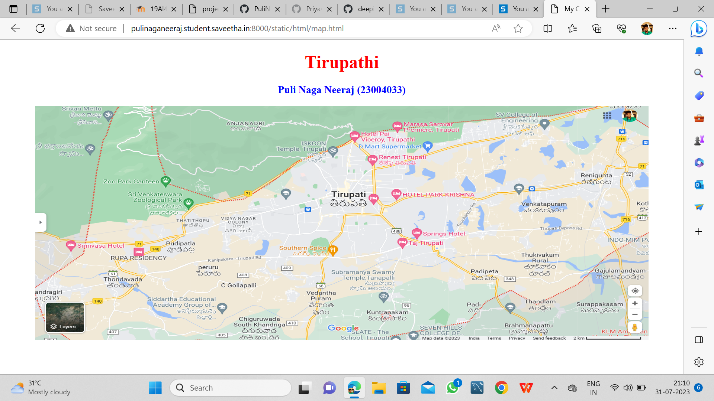
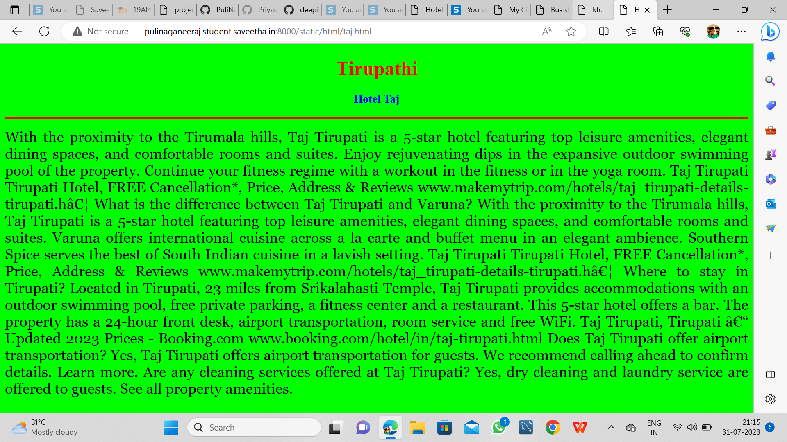
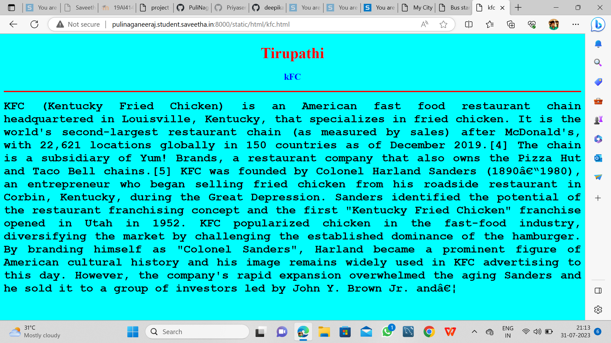
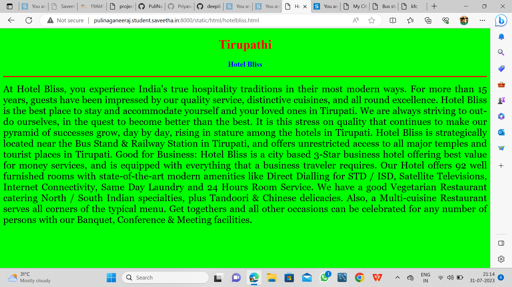
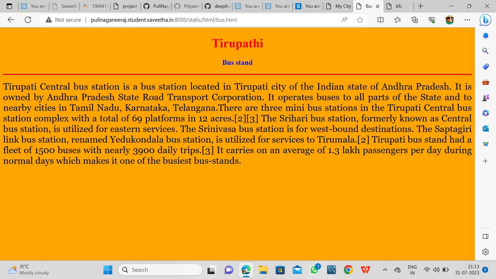
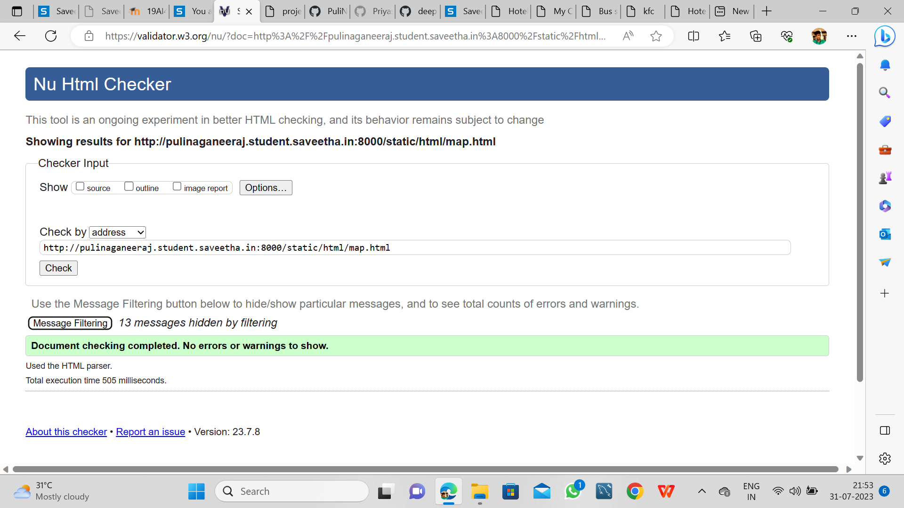

# Places Around Me
## AIM:
To develop a website to display details about the places around my house.

## Design Steps:

### Step 1:
clone the github repository into Theia IDE

### Step 2:
 create a new Django project

### Step 3:
write the needed HTML code.

### Step 4:
Run the Django server and execute the HTML files.

## Code:
```
map.html
<!DOCTYPE html>
<html lang="en">
<head>
<title>My City</title>
</head>
<body>
<h1 align="center">
<font color="red"><b>Tirupathi</b></font>
</h1>
<h3 align="center">
<font color="blue"><b>Puli Naga Neeraj (23004033)</b></font>
</h3>
<center>

<map name="MyCity">
<area shape="circle" coords="190,50,20" href="/static/html/kfc.html" title="kfc">
<area shape="rectangle" coords="230,30,260,60" href="/static/html/sth.html" title="Hotel Bliss">
<area shape="circle" coords="400,350,50" href="/static/html/rr.html" title="Hotel Taj">
<area shape="rectangle" coords="490,150,870,320" href="/static/html/bs.html" title="bus stand">
</map>
</center>
</body>
</html>

bus.html
<!DOCTYPE html>
<html lang="en">
<head>
<title>Bus stand</title>
</head>
<body bgcolor="orange">
<h1 align="center">
<font color="red"><b>Tirupathi</b></font>
</h1>
<h3 align="center">
<font color="blue"><b>Bus stand</b></font>
</h3>
<hr size="3" color="red">
<p align="justify">
<font face="Georgia" size="5">
Tirupati Central bus station is a bus station located in Tirupati city of the Indian state of Andhra Pradesh. It is owned by Andhra Pradesh State Road Transport Corporation. It operates buses to all parts of the State and to nearby cities in Tamil Nadu, Karnataka, Telangana.There are three mini bus stations in the Tirupati Central bus station complex with a total of 69 platforms in 12 acres.[2][3] The Srihari bus station, formerly known as Central bus station, is utilized for eastern services. The Srinivasa bus station is for west-bound destinations. The Saptagiri link bus station, renamed Yedukondala bus station, is utilized for services to Tirumala.[2]

Tirupati bus stand had a fleet of 1500 buses with nearly 3900 daily trips.[3] It carries on an average of 1.3 lakh passengers per day during normal days which makes it one of the busiest bus-stands.</font>
</p>
</body>
</html>

kfc.html
<!DOCTYPE html>
<html lang="en">
<head>
<title>kfc</title>
</head>
<body bgcolor="cyan">
<h1 align="center">
<font color="red"><b>Tirupathi</b></font>
</h1>
<h3 align="center">
<font color="blue"><b>kFC</b></font>
</h3>
<hr size="3" color="red">
<p align="justify">
<font face="Courier New" size="5">
<b>
KFC (Kentucky Fried Chicken) is an American fast food restaurant chain headquartered in Louisville, Kentucky, that specializes in fried chicken. It is the world's second-largest restaurant chain (as measured by sales) after McDonald's, with 22,621 locations globally in 150 countries as of December 2019.[4] The chain is a subsidiary of Yum! Brands, a restaurant company that also owns the Pizza Hut and Taco Bell chains.[5]
KFC was founded by Colonel Harland Sanders (1890–1980), an entrepreneur who began selling fried chicken from his roadside restaurant in Corbin, Kentucky, during the Great Depression. Sanders identified the potential of the restaurant franchising concept and the first "Kentucky Fried Chicken" franchise opened in Utah in 1952. KFC popularized chicken in the fast-food industry, diversifying the market by challenging the established dominance of the hamburger. By branding himself as "Colonel Sanders", Harland became a prominent figure of American cultural history and his image remains widely used in KFC advertising to this day. However, the company's rapid expansion overwhelmed the aging Sanders and he sold it to a group of investors led by John Y. Brown Jr. and…</b>
</font>
</p>
</body>
</html>

hotelbliss.html
<!DOCTYPE html>
<html lang="en">
<head>
<title>Hotel Bliss</title>
</head>
<body bgcolor="lime">
<h1 align="center">
<font color="red"><b>Tirupathi</b></font>
</h1>
<h3 align="center">
<font color="blue"><b>Hotel Bliss</b></font>
</h3>
<hr size="3" color="red">
<p align="justify">
<font face="Georgia" size="5">
At Hotel Bliss, you experience India's true hospitality traditions in their most modern ways. For more than 15 years, guests have been impressed by our quality service, distinctive cuisines, and all round excellence. Hotel Bliss is the best place to stay and accommodate yourself and your loved ones in Tirupati. We are always striving to out-do ourselves, in the quest to become better than the best.

It is this stress on quality that continues to make our pyramid of successes grow, day by day, rising in stature among the hotels in Tirupati. Hotel Bliss is strategically located near the Bus Stand & Railway Station in Tirupati, and offers unrestricted access to all major temples and tourist places in Tirupati.

Good for Business:

Hotel Bliss is a city based 3-Star business hotel offering best value for money services, and is equipped with everything that a business traveler requires. Our Hotel offers 92 well furnished rooms with state-of-the-art modern amenities like Direct Dialling for STD / ISD, Satellite Televisions, Internet Connectivity, Same Day Laundry and 24 Hours Room Service. We have a good Vegetarian Restaurant catering North / South Indian specialties, plus Tandoori & Chinese delicacies. Also, a Multi-cuisine Restaurant serves all corners of the typical menu. Get togethers and all other occasions can be celebrated for any number of persons with our Banquet, Conference & Meeting facilities.
</font>
</p>
</body>
</html>

taj.html
<!DOCTYPE html>
<html lang="en">
<head>
<title>Hotel Taj</title>
</head>
<body bgcolor="lime">
<h1 align="center">
<font color="red"><b>Tirupathi</b></font>
</h1>
<h3 align="center">
<font color="blue"><b>Hotel Taj</b></font>
</h3>
<hr size="3" color="red">
<p align="justify">
<font face="Georgia" size="5">
With the proximity to the Tirumala hills, Taj Tirupati is a 5-star hotel featuring top leisure amenities, elegant dining spaces, and comfortable rooms and suites. Enjoy rejuvenating dips in the expansive outdoor swimming pool of the property. Continue your fitness regime with a workout in the fitness or in the yoga room. Taj Tirupati Tirupati Hotel, FREE Cancellation*, Price, Address & Reviews www.makemytrip.com/hotels/taj_tirupati-details-tirupati.h… What is the difference between Taj Tirupati and Varuna? With the proximity to the Tirumala hills, Taj Tirupati is a 5-star hotel featuring top leisure amenities, elegant dining spaces, and comfortable rooms and suites. Varuna offers international cuisine across a la carte and buffet menu in an elegant ambience. Southern Spice serves the best of South Indian cuisine in a lavish setting. Taj Tirupati Tirupati Hotel, FREE Cancellation*, Price, Address & Reviews www.makemytrip.com/hotels/taj_tirupati-details-tirupati.h… Where to stay in Tirupati? Located in Tirupati, 23 miles from Srikalahasti Temple, Taj Tirupati provides accommodations with an outdoor swimming pool, free private parking, a fitness center and a restaurant. This 5-star hotel offers a bar. The property has a 24-hour front desk, airport transportation, room service and free WiFi. Taj Tirupati, Tirupati – Updated 2023 Prices - Booking.com www.booking.com/hotel/in/taj-tirupati.html Does Taj Tirupati offer airport transportation? Yes, Taj Tirupati offers airport transportation for guests. We recommend calling ahead to confirm details. Learn more. Are any cleaning services offered at Taj Tirupati? Yes, dry cleaning and laundry service are offered to guests. See all property amenities.</font>
</p>
</body>
</html>
```

## Output:










## HTML Validator



## Result:
The program for implementing image map is executed successfully